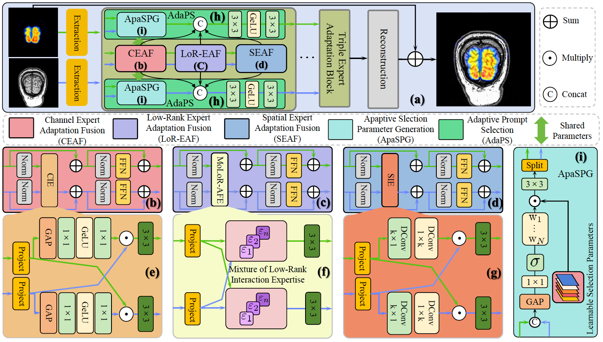
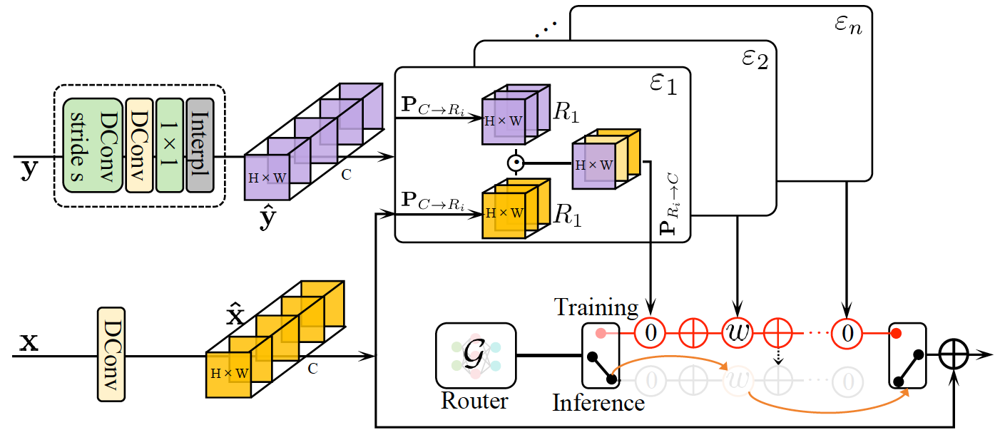
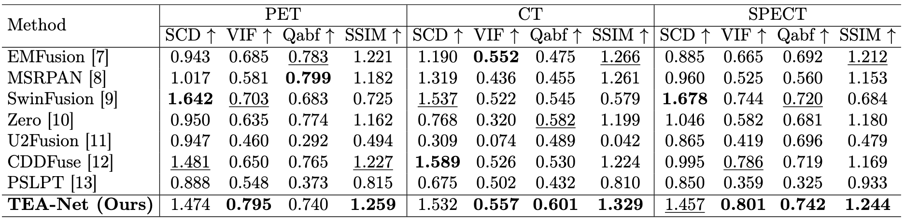
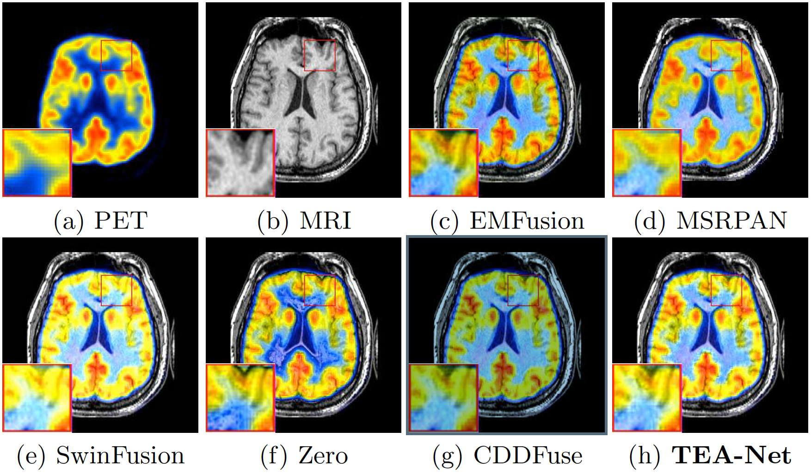
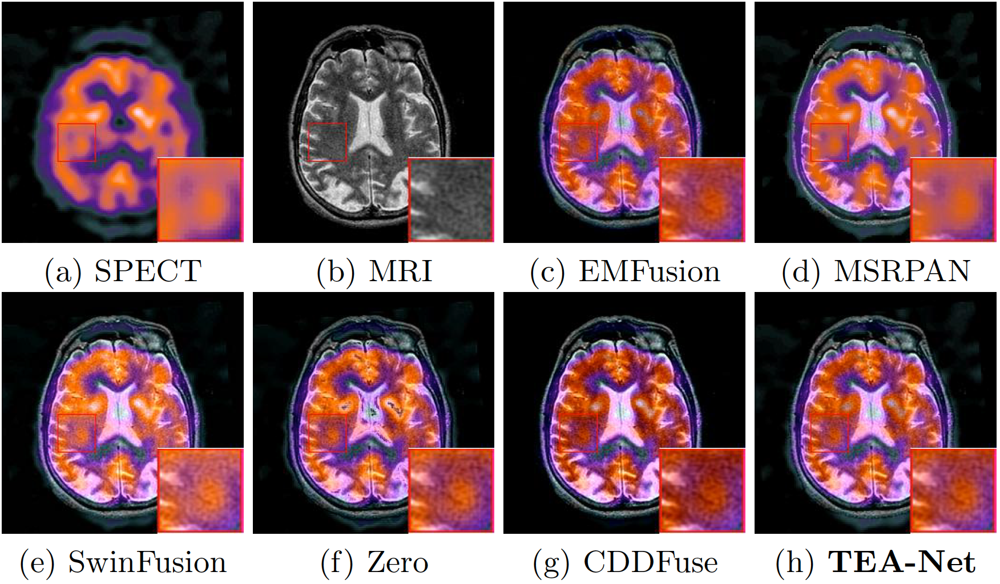

# TEA-Net [MICCAI Workshop on Efficient Medical AI (Oral)]

This is the official PyTorch codes for the paper  
Triple Expert Adaptation Networks with Adaptive Prompt Selection for Multi-Modal Medical Image Fusion  
[Cong Wang](https://scholar.google.com/citations?user=0DrHHRwAAAAJ&hl=zh-CN), [Kang Wang](https://profiles.ucsf.edu/kang.wang), [Yang Yang](https://profiles.ucsf.edu/yang.yang)

## Abstract

Multi-modal medical image fusion seeks to integrate complementary information from heterogeneous imaging modalities to enhance clinical diagnostics. 
However, it faces challenges in reconciling channel-wise feature conflicts, spatial misalignments, and redundant feature propagation. 
In this paper, we propose a Triple Expert Adaptation Network (TEA-Net) to address these limitations through three domain-specific fusion mechanisms: 
Channel Expert Adaptation Fusion (CEAF), Low-Rank Expert Adaptation Fusion (LoR-EAF), and Spatial Expert Adaptation Fusion (SEAF). 
The CEAF employs globally dynamic channel attention to resolve intensity conflicts across different modalities. 
The LoR-EAF focuses on modulating the most relevant interactions between modalities in low-rank to compress extraneous information. 
The SEAF integrates large-kernel convolutions with cross-modality interactions to align features across different modalities. 
To boost fusion, we introduce an adaptive prompt selection module that utilizes learnable prompts to guide fusion among experts. 
Experiments on publicly available datasets demonstrate the superiority of our TEA-Net over state-of-the-art methods.


## Overall of TEA-Net

Our TEA-Net processes inputs from two different modalities.
These images undergo feature extraction and selection expert adaptation fusion, culminating in the reconstruction of fused images.
The selection expert adaptation fusion encompasses Channel Expert Adaptation Fusion (CEAF), Low-Rank Expert Adaptation Fusion (LoR-EAF), and Spatial Expert Adaptation Fusion (SEAF).
These modules enhance the preservation of modality-specific features, resolve spatial misalignments, and reduce redundant feature propagation.
To further boost fusion, we propose Adaptive Prompt Selection, which generates learnable prompt parameters to select more useful features among these three experts for fusion.


## Mixture of Low-Rank Interaction Expertise

Mixture of Low-Rank Interaction Expertise. 
During the training phase, our method learns from various experts. However, during inference, only the selected top-$k$ experts are utilized for computation, thereby enhancing efficiency.

## Main Results


### Quantitive Results



### MRI-PET


### MRI-SPECT



## Datasets Download

[Havard-Medical-Image-Fusion-Datasets](https://drive.google.com/drive/folders/1vYPBGZGc97MLGhMSSpxq9z4Y3YLxhKy9?usp=sharing)


## Pretrained models

[pretrained models](https://drive.google.com/drive/folders/1D0XX0ltPfG4Xnri0_OssId7pyATcMGer?usp=sharing)


## Train, Test, and Evaluation

### Train

#### MRI-CT
```
python train_ct.py
```

#### MRI-PET
```
python train_pet.py
```

#### MRI-SPECT
```
python train_spect.py
```

### Test

#### MRI-CT
```
python test_ct.py
```

#### MRI-PET
```
python test_pet.py
```

#### MRI-SPECT
```
python test_spect.py
```

### Evaluation

#### MRI-CT
```
python Metric_Python/eval_one_method_ct.py
```

#### MRI-PET
```
python Metric_Python/eval_one_method_pet.py
```

#### MRI-SPECT
```
python Metric_Python/eval_one_method_spect.py
```
The results will be saved in the folder of [Metric](Metric) 


## Our Visual Results

[MRI-CT](save_images_ct)

[MRI-PET](save_images_pet)

[MRI-SPECT](save_images_spect)

## Citation
```
@inproceedings{wang2025teanet,
  title={Triple Expert Adaptation Networks with Adaptive Prompt Selection for Multi-Modal Medical Image Fusion},
  author={Wang, Cong and Wang, Kang and Yang, Yang},
  booktitle={The 1st MICCAI Workshop on Efficient Medical AI},
  year={2025}
}
```

## Contact

Cong Wang [supercong94@gmail.com]


